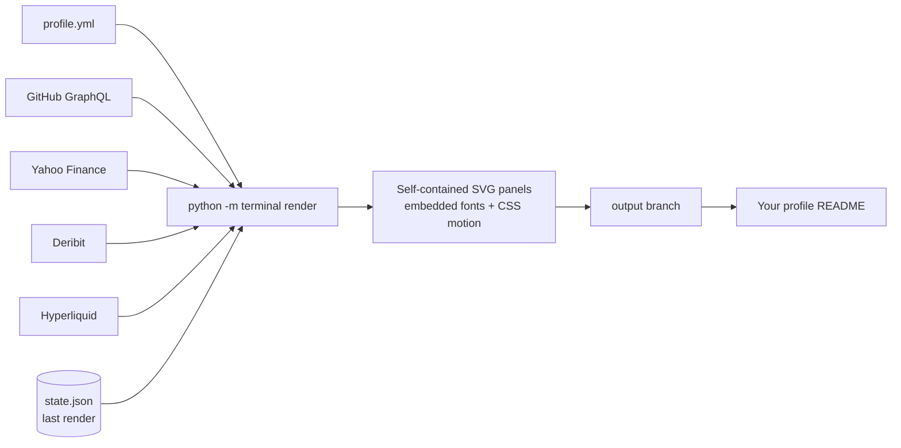

<div align="center">

# profile-terminal

**Turn your GitHub profile README into a live trading terminal.**

Animated SVG panels, real market data, your real GitHub numbers. Rendered hourly by GitHub Actions. No servers, no API keys.

[](https://github.com/billpwchan/profile-terminal/generate)
[](https://github.com/billpwchan/profile-terminal/stargazers)
[](LICENSE)

[English](README.md) · [简体中文](README.zh-CN.md)

</div>

<p align="center">


</p>

<p align="center"><sub>Everything above is this repository's own output, refreshed by its workflow. The persona and its GitHub numbers are sample data (demo mode); the market panels are live.</sub></p>

## Why it stands out

Most profile READMEs stack the same stats cards, badges and typing banners. This one is a single designed object: one grid, one typeface, one motion language, and data that is actually alive.

- **Live markets, keyless.** A ticker tape that leads with whichever exchange is in session, a cross-asset risk monitor (realized vol, drawdown, correlation), an options vol term structure from Deribit and perp funding from Hyperliquid.
- **It reads the data for you.** Crosshairs glide along your real contribution and star curves and settle on values with axis tags; cursors walk the risk blotter and the strongest correlations; a regime monitor turns numbers into states (vol elevated, curve inverted, longs crowded).
- **Change flashes.** Values that moved since the last render flash green or red once, like quotes updating on a terminal.
- **Your real GitHub, rendered properly.** Contributions, streaks, a commit-hour histogram in your timezone, star history for each featured repo, recent pushes, and an optional contribution snake.
- **Zero infrastructure.** Pure SVG with CSS animation, served from an `output` branch. No servers, no scripts in the images, no third-party widget services to go down.
- **Robust.** Every feed is isolated; a failed source keeps its previous panel. Fonts are subsetted and embedded so it looks identical everywhere. `prefers-reduced-motion` is respected.

## Quick start

1. **[Use this template](https://github.com/billpwchan/profile-terminal/generate)** and name the new repository **exactly your username**, public. That makes it your profile README.
2. **Edit [`profile.yml`](profile.yml)**: your name, role, the five function-code rows, links, and two or four repos to feature.
3. **Run the workflow** (Actions → `render` → Run workflow). It renders every panel to the `output` branch and writes your `README.md` from the config. After that it refreshes on its own every hour.

That's it. Demo mode switches off automatically once the repo is named after you.

> [!TIP]
> The default `GITHUB_TOKEN` reads public data. To count private contributions, add a repository secret `PROFILE_TOKEN` (a classic personal access token with `read:user`).

## Themes

Set `theme:` in `profile.yml`, or any hex colour with `accent:`.

| `amber` | `phosphor` |
|:--:|:--:|
|  |  |
| **`ice`** | **`magenta`** |
|  |  |

## Panels

| Panel | What it shows | Source |
|:--|:--|:--|
| Hero | Name, role, five function-code rows, live ticker tape, session states, 12-month contributions with a crosshair | GitHub GraphQL, Yahoo Finance |
| Keys | Up to five link keys; the GitHub key shows live stars and followers | config, GitHub |
| Work | Two or four repos with their full star history | GitHub GraphQL |
| Regime monitor | Volatility regime, crypto/equity coupling, worst drawdown, vol-curve slope, funding carry | derived |
| Risk monitor | 20D/60D realized vol, position in the 6M range, max drawdown, correlation matrix | Yahoo Finance |
| Derivatives | ATM implied vol term structure, put/call open interest, perp funding and open interest | Deribit, Hyperliquid |
| Commit profile | Commits by hour (your timezone) and weekday, with session bands | GitHub GraphQL |
| Contributions | Calendar heatmap, or the [snk](https://github.com/Platane/snk) snake in your accent colour | GitHub |
| Recent pushes | Latest public repos outside your featured set | GitHub GraphQL |

Remove `markets.tape` / `options` / `perps` entries to drop a panel, or swap symbols for any Yahoo Finance ticker: FX, indices, single stocks, commodities.

## Configuration

Everything lives in [`profile.yml`](profile.yml), commented line by line. The short version:

```yaml
timezone: Asia/Singapore
theme: phosphor
identity:
  name: YOUR NAME
  role: SOFTWARE ENGINEER · SINGAPORE
  rows:
    - [EDGE, "Distributed systems, low-latency services"]
    - [NOW, "Building an open-source feature store"]
work:
  repos:
    - { repo: my-best-project, tag: INFRA, pitch: "One line on why it matters", sub: "One line of proof" }
markets:
  tape:
    - { symbol: ^STI, label: STI, risk: true, session: SGX }
  sessions:
    - { name: SGX, tz: Asia/Singapore, open: "09:00", close: "17:00", lunch: "12:00-13:00" }
```

Preview locally without any network access:

```bash
pip install -r requirements.txt
python -m terminal render --offline && python -m terminal preview   # then open dist/preview.html
```

## How it works



Each panel is a standalone SVG with its fonts subsetted and embedded as WOFF2, and its motion written as CSS keyframes: no JavaScript, which GitHub would strip anyway. The workflow restores the previous `output` branch before rendering, so a feed that fails keeps its last good panel, and `state.json` remembers values for the change flashes. Panels tile with zero gaps because their gutters are drawn inside the SVGs.

## FAQ

**How fresh is the data?** The workflow is scheduled hourly. GitHub can delay scheduled runs when its runners are busy, so in practice expect a refresh every one to few hours. Market panels show their timestamp.

**Does it work in light mode?** Yes. The terminal is deliberately always dark, like a real trading screen, and reads as a set of screens on either theme.

**Do I need to trade or care about markets?** No. Keep the tape to a few indices you like, or delete `markets` entirely; the GitHub panels stand on their own.

**Can I use it outside a profile repo?** Yes. Embed any panel from your `output` branch anywhere that renders images.

**Is the market data investment advice?** No. It is informational, from public endpoints, and may be delayed or wrong.

## Credits

[IBM Plex Mono](https://github.com/IBM/plex) (SIL Open Font License), [Platane/snk](https://github.com/Platane/snk) for the snake, and the public market data endpoints of Yahoo Finance, Deribit and Hyperliquid. Released under the [MIT License](LICENSE).

If this made your profile better, a ⭐ helps other people find it.
