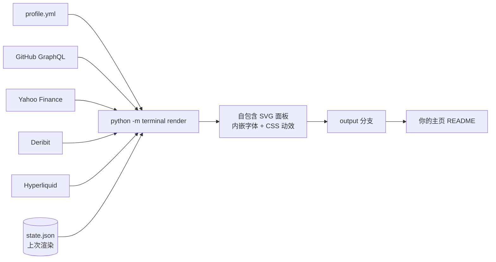

<div align="center">

# profile-terminal

**把你的 GitHub 主页 README 变成一台实时交易终端。**

动态 SVG 面板、真实行情、你真实的 GitHub 数据。GitHub Actions 每小时自动渲染。不需要服务器，不需要任何 API key。

[](https://github.com/billpwchan/profile-terminal/generate)
[](https://github.com/billpwchan/profile-terminal/stargazers)
[](LICENSE)

[English](README.md) · [简体中文](README.zh-CN.md)

</div>

<p align="center">


</p>

<p align="center"><sub>上面所有内容都是本仓库自己的 workflow 渲染出来的。人物和 GitHub 数字是演示数据（demo 模式），行情面板是实时的。</sub></p>

## 为什么与众不同

大多数主页 README 都在堆同样的统计卡片、徽章和打字机横幅。这个是一个完整设计过的整体：一套网格、一种字体、一种动效语言，数据是真正活的。

- **实时行情，无需密钥。** 行情带会自动把正在交易时段的市场排在最前；跨资产风险监控（已实现波动率、回撤、相关性）；来自 Deribit 的期权隐含波动率期限结构，来自 Hyperliquid 的永续资金费率。
- **它会替你读数据。** 十字光标沿着你真实的贡献曲线和 star 曲线滑动，停在数值上并显示坐标标签；光标逐行扫过风险表和最强的相关性；状态监控把数字翻译成结论（波动偏高、曲线倒挂、多头拥挤）。
- **变动闪烁。** 与上次渲染相比有变化的数值会闪一下红或绿，像终端上的报价刷新。
- **把你的 GitHub 好好呈现出来。** 贡献、连续天数、按你时区统计的提交时段分布、每个精选仓库的 star 历史、最近推送，以及可选的贡献贪吃蛇。
- **零基础设施。** 纯 SVG + CSS 动画，从 `output` 分支提供。没有服务器，图片里没有脚本，也不依赖任何会挂掉的第三方卡片服务。
- **稳健。** 每个数据源相互隔离，某个源失败时保留它上一次的面板。字体子集化后内嵌，在任何地方显示都一致。尊重 `prefers-reduced-motion`。

## 快速开始

1. **[Use this template](https://github.com/billpwchan/profile-terminal/generate)**，新仓库名**必须和你的用户名完全一致**，设为 public。这样它就成了你的主页 README。
2. **编辑 [`profile.yml`](profile.yml)**：名字、角色、五行功能码、链接，以及要展示的两个或四个仓库。
3. **运行 workflow**（Actions → `render` → Run workflow）。它会把所有面板渲染到 `output` 分支，并根据配置生成你的 `README.md`。之后每小时自动刷新。

就这样。仓库一旦以你的用户名命名，demo 模式会自动关闭。

> [!TIP]
> 默认的 `GITHUB_TOKEN` 只能读公开数据。如果想统计私有仓库的贡献，添加一个仓库 secret `PROFILE_TOKEN`（带 `read:user` 权限的 classic personal access token）。

## 主题

在 `profile.yml` 里设置 `theme:`，或者用 `accent:` 指定任意十六进制颜色。

| `amber` | `phosphor` |
|:--:|:--:|
|  |  |
| **`ice`** | **`magenta`** |
|  |  |

## 面板

| 面板 | 内容 | 数据源 |
|:--|:--|:--|
| Hero | 名字、角色、五行功能码、实时行情带、交易时段状态、带十字光标的 12 个月贡献曲线 | GitHub GraphQL、Yahoo Finance |
| Keys | 最多五个链接键；GitHub 键显示实时 star 和 follower 数 | 配置、GitHub |
| Work | 两个或四个仓库及其完整 star 历史 | GitHub GraphQL |
| Regime monitor | 波动状态、加密/股票联动、最大回撤、波动率曲线斜率、资金费率 carry | 推导 |
| Risk monitor | 20 日/60 日已实现波动率、在 6 个月区间中的位置、最大回撤、相关性矩阵 | Yahoo Finance |
| Derivatives | ATM 隐含波动率期限结构、put/call 持仓量、永续资金费率与持仓量 | Deribit、Hyperliquid |
| Commit profile | 按小时（你的时区）和星期分布的提交，带时段色带 | GitHub GraphQL |
| Contributions | 日历热力图，或你主题色的 [snk](https://github.com/Platane/snk) 贪吃蛇 | GitHub |
| Recent pushes | 精选之外最近推送的公开仓库 | GitHub GraphQL |

删掉 `markets.tape` / `options` / `perps` 中的条目即可去掉对应面板；也可以换成任意 Yahoo Finance 代码：外汇、指数、个股、大宗商品。

## 配置

所有配置都在 [`profile.yml`](profile.yml) 里，逐行有注释。简版示例：

```yaml
timezone: Asia/Shanghai
theme: phosphor
identity:
  name: YOUR NAME
  role: SOFTWARE ENGINEER · SHANGHAI
  rows:
    - [EDGE, "Distributed systems, low-latency services"]
    - [NOW, "Building an open-source feature store"]
work:
  repos:
    - { repo: my-best-project, tag: INFRA, pitch: "One line on why it matters", sub: "One line of proof" }
markets:
  tape:
    - { symbol: 000300.SS, label: CSI300, risk: true, session: SSE }
    - { symbol: ^HSI, label: HSI, risk: true, session: HKEX }
  sessions:
    - { name: SSE, tz: Asia/Shanghai, open: "09:30", close: "15:00", lunch: "11:30-13:00" }
    - { name: HKEX, tz: Asia/Hong_Kong, open: "09:30", close: "16:00", lunch: "12:00-13:00" }
```

> [!NOTE]
> 面板使用内嵌的 IBM Plex Mono 子集，只覆盖拉丁字符。`profile.yml` 里的文字请用英文（这也更像真正的终端）。

本地预览，无需联网：

```bash
pip install -r requirements.txt
python -m terminal render --offline && python -m terminal preview   # 然后打开 dist/preview.html
```

## 工作原理



每个面板都是独立的 SVG：字体子集化后以 WOFF2 内嵌，动效全部用 CSS keyframes 写成，没有 JavaScript（GitHub 反正也会剥掉）。workflow 渲染前会先恢复上一版 `output` 分支，所以失败的数据源会保留最后一次正常的面板；`state.json` 记住上次的数值用于变动闪烁。面板之间零缝隙拼接，因为间距画在 SVG 内部。

## 常见问题

**数据多新？** workflow 按每小时调度。GitHub 在 runner 繁忙时会推迟定时任务，实际大约每一到几个小时刷新一次。行情面板上会显示时间戳。

**浅色模式下能用吗？** 能。终端刻意始终保持深色，像真正的交易屏幕，在两种主题下看起来都是一组屏幕。

**我不炒股也能用吗？** 能。行情带只留几个你喜欢的指数，或者直接删掉 `markets`；GitHub 相关面板可以独立成立。

**能在主页之外用吗？** 能。`output` 分支里的任何面板都可以嵌入到任何能显示图片的地方。

**行情数据是投资建议吗？** 不是。仅供展示，来自公开接口，可能延迟或有误。

## 致谢

[IBM Plex Mono](https://github.com/IBM/plex)（SIL Open Font License）、[Platane/snk](https://github.com/Platane/snk) 的贪吃蛇，以及 Yahoo Finance、Deribit、Hyperliquid 的公开行情接口。以 [MIT License](LICENSE) 发布。

如果它让你的主页变得更好，点个 ⭐ 能帮更多人发现它。
